# 🧠 DiaryVault Memory Layer

### An open-source memory layer for humans.

Your journal. Your memories. Your keys. Immutable. Verifiable. Forever.

[](LICENSE)
[](https://github.com/DiaryVault/diaryvault-memory-layer/actions/workflows/ci.yml)
[](https://python.org)
[](https://pypi.org/project/diaryvault-memory/)
[](CONTRIBUTING.md)

<p align="center">
  
</p>

---

## The Problem

Every day, you generate thousands of thoughts, decisions, and experiences. They live in your head — and your head forgets.

Meanwhile:

- AI can now generate fake photos, voices, text, and video indistinguishable from reality
- Your personal data is scattered across platforms you don't control
- There is no verifiable, tamper-proof record that **you** lived **your** life

Planes have black boxes. Cars have dash cams. Companies have audit logs.

**Humans have nothing.**

## The Vision

DiaryVault Memory Layer is an open-source framework that turns your daily journal entries into **cryptographically verified, encrypted, permanent memory records**.

Think of it as a **personal black box for your life**.

```
You write → AI enriches → System encrypts → Hash anchors → Memory preserved forever
```

Your future personal AI — your copilot, your digital twin, your legacy — will need a trusted memory source. This is that source.

## Quick Start

```bash
pip install diaryvault-memory
```

```python
from diaryvault_memory import MemoryVault

# Initialize your vault
vault = MemoryVault(encryption_key="your-secret-key")

# Create an immutable memory
memory = vault.create(
    content="Today I decided to quit my job and start a company. "
            "I've never been more terrified or more alive.",
    tags=["career", "milestone", "2025"]
)

# Memory is now:
# ✓ SHA-256 hashed
# ✓ AES-256 encrypted
# ✓ Timestamped (RFC 3339)
# ✓ Signed with your key
print(memory.hash)       # a7f3b2c1d4e5...
print(memory.timestamp)  # 2025-02-07T14:32:01Z
print(memory.verified)   # True

# Verify integrity at any point
assert vault.verify(memory) == True

# Anchor to permanent storage (optional)
vault.anchor(memory, backend="arweave")  # or "ethereum", "local"
```

**That's it.** Your memory is now immutable, encrypted, and optionally anchored on-chain.

## How It Works

```
┌─────────────────────────────────────────────────────────┐
│                    YOUR LIFE                             │
│  journals · photos · decisions · health · thoughts      │
└─────────────────┬───────────────────────────────────────┘
                  │
                  ▼
┌─────────────────────────────────────────────────────────┐
│              CAPTURE LAYER                               │
│  Manual entries · AI agents · API integrations           │
│  Calendar sync · Photo capture · Voice notes             │
└─────────────────┬───────────────────────────────────────┘
                  │
                  ▼
┌─────────────────────────────────────────────────────────┐
│              SYNTHESIS LAYER                              │
│  AI narrative generation · Summarization                 │
│  Pattern detection · Emotional analysis                  │
│  Context enrichment · Cross-reference                    │
└─────────────────┬───────────────────────────────────────┘
                  │
                  ▼
┌─────────────────────────────────────────────────────────┐
│              VERIFICATION LAYER                           │
│  SHA-256 hashing · AES-256 encryption                    │
│  RFC 3339 timestamping · Digital signatures               │
│  Merkle tree for batch verification                      │
└─────────────────┬───────────────────────────────────────┘
                  │
                  ▼
┌─────────────────────────────────────────────────────────┐
│              PERMANENCE LAYER                             │
│  Local encrypted storage · Arweave · IPFS                │
│  Ethereum L2 hash anchoring · Personal servers           │
└─────────────────────────────────────────────────────────┘
```

## Features

**🔐 Military-Grade Encryption** — AES-256-GCM encryption. Your memories are unreadable without your key. Not even we can read them.

**🔗 Cryptographic Verification** — Every entry is SHA-256 hashed and timestamped. Prove when you wrote what you wrote.

**🌐 Blockchain Anchoring** — Optionally anchor hashes to Arweave, Ethereum L2, or IPFS for tamper-proof permanence. No tokens required.

**🤖 AI Agent Framework** — Pluggable agents that capture, synthesize, and enrich your daily memories. Bring your own LLM.

**📦 Open Memory Format** — `.dvmem` — a documented, open format so your data is never locked in. Export anytime.

**🔑 Dead Man's Switch** — Designate trusted parties who can access your vault after a configurable inactivity period.

**🏠 Self-Hostable** — Run entirely on your own hardware. No cloud required. No trust required.

## Architecture

See [ARCHITECTURE.md](docs/ARCHITECTURE.md) for the full technical deep dive.

The system is built on four principles:

1. **Privacy First** — Encryption happens client-side before anything leaves your device
2. **Verify Everything** — Every operation produces a cryptographic proof
3. **Own Your Data** — Open formats, open code, export anytime
4. **Permanence Optional** — Choose your storage backend: local, cloud, or blockchain

## Use Cases

| Use Case | Description |
|---|---|
| **Digital Legacy** | Preserve your life story for future generations |
| **Legal Evidence** | Timestamped, tamper-proof personal records |
| **AI Twin Training** | Structured life data for training your personal AI |
| **Health Timeline** | Verifiable medical history and symptom tracking |
| **Estate Planning** | Secure vault with designated beneficiary access |
| **Identity Proof** | Continuous proof-of-humanity through narrative |
| **Memory Aid** | AI-powered recall for important life events |

## Roadmap

- [x] Core SDK — hash, encrypt, verify, store
- [x] Memory format spec (`.dvmem`)
- [ ] AI synthesis agents (v0.2)
- [ ] Arweave anchoring (v0.3)
- [ ] Ethereum L2 anchoring (v0.3)
- [ ] Photo/voice capture agents (v0.4)
- [ ] Dead man's switch (v0.5)
- [ ] Personal AI training export (v0.6)
- [ ] Mobile SDK (v0.7)
- [ ] DiaryVault app integration (v1.0)

## Built By

**[DiaryVault](https://diaryvault.com)** — AI-powered journaling for the modern human.

The Memory Layer is the open-source foundation. DiaryVault is the beautiful app built on top of it.

## Contributing

We welcome contributions! See [CONTRIBUTING.md](CONTRIBUTING.md) for guidelines.

Priority areas:
- Storage backend adapters (IPFS, Filecoin, Ceramic)
- AI agent plugins
- Language SDKs (TypeScript, Rust, Go)
- Mobile integration
- Documentation and tutorials

## Philosophy

> "The palest ink is better than the best memory." — Chinese Proverb

We believe your memories belong to you. Not to a platform. Not to a corporation. Not to an algorithm.

The Memory Layer is infrastructure for a future where every human has a verified, permanent, private record of their existence — accessible to them, inheritable by their loved ones, and uneditable by anyone else.

This is not a product. It's a protocol. Build on it.

## License

MIT — Use it. Fork it. Build on it. Remember everything.

---

<p align="center">
  <strong>Own your life story forever.</strong><br>
  <a href="https://diaryvault.com">diaryvault.com</a> · <a href="https://twitter.com/diaryvault">@diaryvault</a> · <a href="https://discord.gg/diaryvault">Discord</a>
</p>
